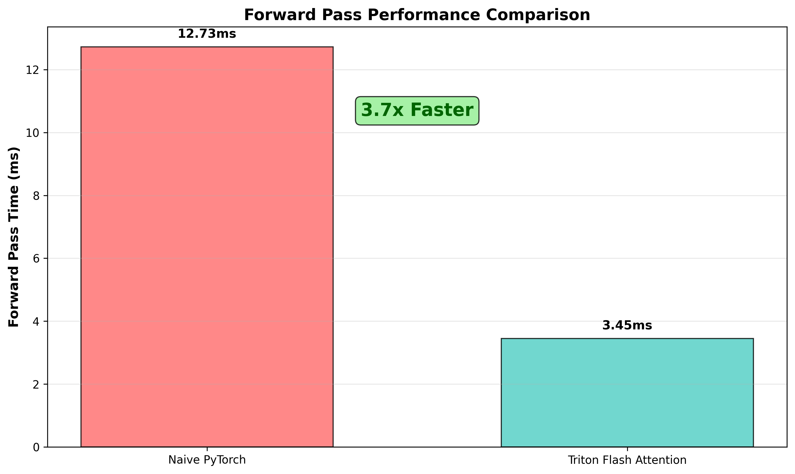

<div align="center">

# Easy and hackable implementation of FlashAttention in Triton kernels

</div>


###  Overview

This implementation provides a complete Flash Attention implementation using Triton. It's designed to be educational and hackable (i.e. I didn't have much time to commit to it 😁) – feel free to experiment, copy and modify it!


<br/>

<div align="center">

</div>

<br/>

Tho of course not sota, i tried to keep the code as clean and understandable as possible to make it a useful educational resource (it really helped me get a much stronger grasp of Triton!).

All basic evals were done using CUDA Events wrappers on a single NVIDIA H100 SXM GPU.

### Key files to get started on

#### **High-Level API**
- **`flash_attention/ops/attention.py`** - This is the **main entry point** and high-level API for the entire Flash Attention mechanism. It contains:
  - `TritonAttention` class that orchestrates the complete forward/backward pass
  - Tensor shape validation and memory management
  - Integration bridge between PyTorch autograd and low-level Triton kernels
  - Grid configuration for parallel execution across sequence blocks

#### **Lower-Level Triton Kernels**
- **`flash_attention/kernels/`** - Contains the actual Triton kernel implementations that perform the core Flash Attention computations:
  - **`forward.py`** - Triton kernel for memory-efficient forward pass with online softmax
  - **`backward.py`** - Triton kernel for backward pass gradient computation
  - These kernels implement the block-wise attention algorithm that reduces memory complexity from O(N²) to O(N)

#### **Configuration & Optimization**
- **`flash_attention/config.py`** - Autotuning configurations with different block sizes, warp counts, and pipeline stages for optimal hardware utilization


## Usage Guide

### Run Tests
```bash
# Basic test
python -m flash_attention.scripts.run_test

# Custom parameters
python -m flash_attention.scripts.run_test \
  --batch-size 2 \
  --num-heads 8 \
  --seq-len 1024 \
  --head-dim 64 \
  --causal
```

### Run Benchmarks
```bash
# Basic benchmark
python -m flash_attention.scripts.run_benchmark

# Performance comparison
python -m flash_attention.scripts.run_benchmark \
  --batch-size 4 \
  --num-heads 16 \
  --seq-len 2048 \
  --head-dim 128
```

### Parameters
| Parameter | Default | Description |
|-----------|---------|-------------|
| `--batch-size` | 4 | Batch size |
| `--num-heads` | 8 | Number of attention heads |
| `--seq-len` | 512 | Sequence length |
| `--head-dim` | 64 | Head dimension |
| `--causal` | False | Enable causal masking |

### Requirements
- cuda
- Python 3.8+
- PyTorch 2.4.1+
- Triton 3.0.0
