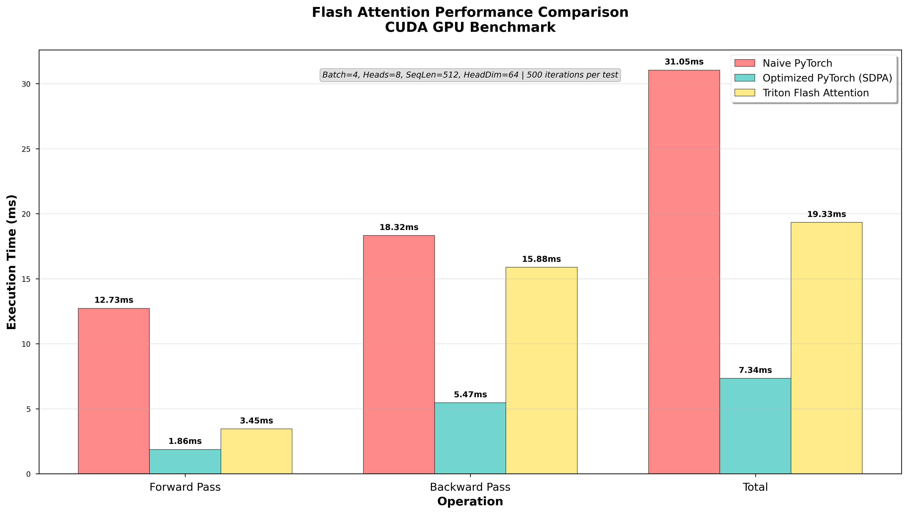
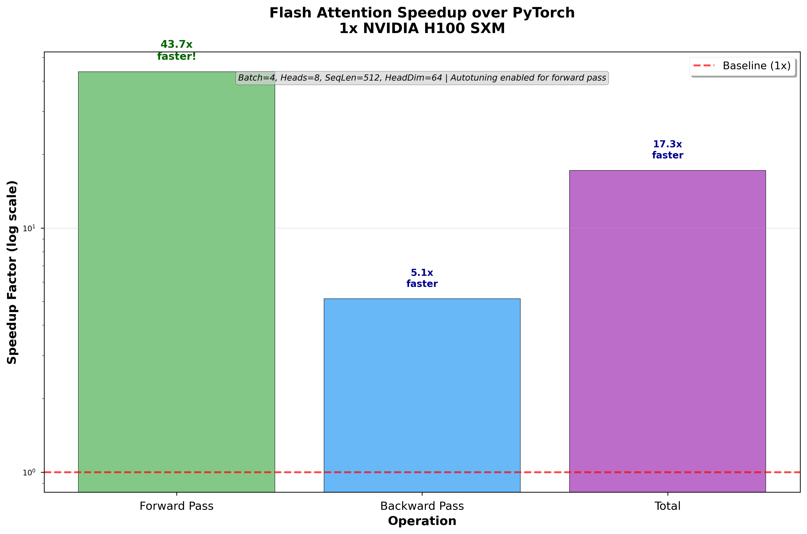

# Easy and hackable implementation of FlashAttention in Triton kernels


<div align="center">

##  Performance Results!

### Execution Time Comparison


### Speedup  


</div>

<div align="center">

## Benchmark Summary

| Operation | PyTorch (ms) | Triton (ms) | **Speedup** |
|-----------|--------------|-------------|-------------|
| Forward   | 4.586        | 0.105       | **43.7x**   |
| Backward  | 1.177        | 0.229       | **5.1x**    |
| **Total** | **5.763**    | **0.334**   | **17.3x**   |

> **Hardware:** 1x NVIDIA H100 SXM  
> **Configuration:** Batch=4, Heads=8, SeqLen=512, HeadDim=64  
> **Autotuning:** Enabled for forward pass
> **(Measured using basic CUDA Events wrapper)**

</div>


## Usage Guide 

### Run Tests
```bash
# Basic test
python -m flash_attention.scripts.run_test

# Custom parameters
python -m flash_attention.scripts.run_test \
  --batch-size 2 \
  --num-heads 8 \
  --seq-len 1024 \
  --head-dim 64 \
  --causal
```

### Run Benchmarks
```bash
# Basic benchmark
python -m flash_attention.scripts.run_benchmark

# Performance comparison
python -m flash_attention.scripts.run_benchmark \
  --batch-size 4 \
  --num-heads 16 \
  --seq-len 2048 \
  --head-dim 128
```

### Parameters
| Parameter | Default | Description |
|-----------|---------|-------------|
| `--batch-size` | 4 | Batch size |
| `--num-heads` | 8 | Number of attention heads |
| `--seq-len` | 512 | Sequence length |
| `--head-dim` | 64 | Head dimension |
| `--causal` | False | Enable causal masking |

### Requirements
- CUDA-compatible GPU
- Python 3.8+
- PyTorch 2.4.1+
- Triton 3.0.0
